# Тестування працездатності системи

Тестування відбувається за допомогою програми Postman

### GET /data/all

    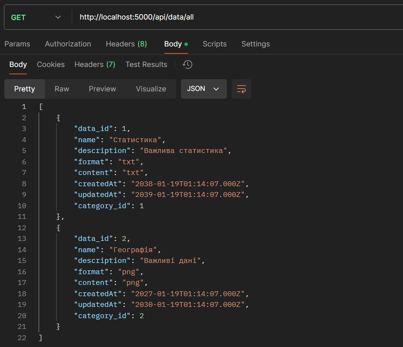

### GET /data/:id

    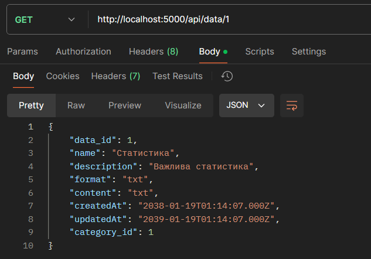

### GET /data/name/:name

    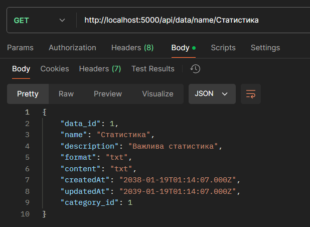

### POST /data

    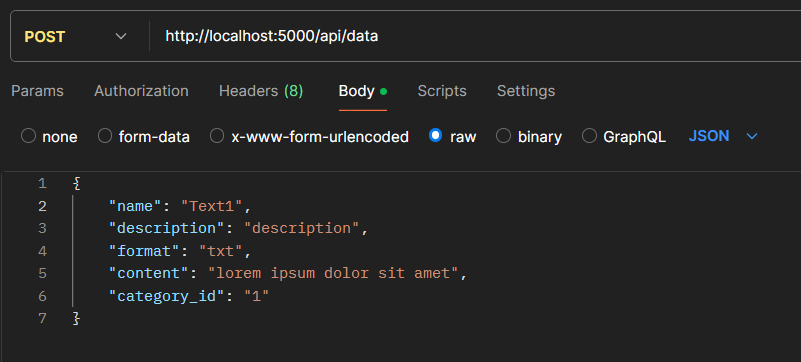
    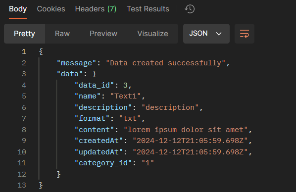

### PATCH /data/:id

    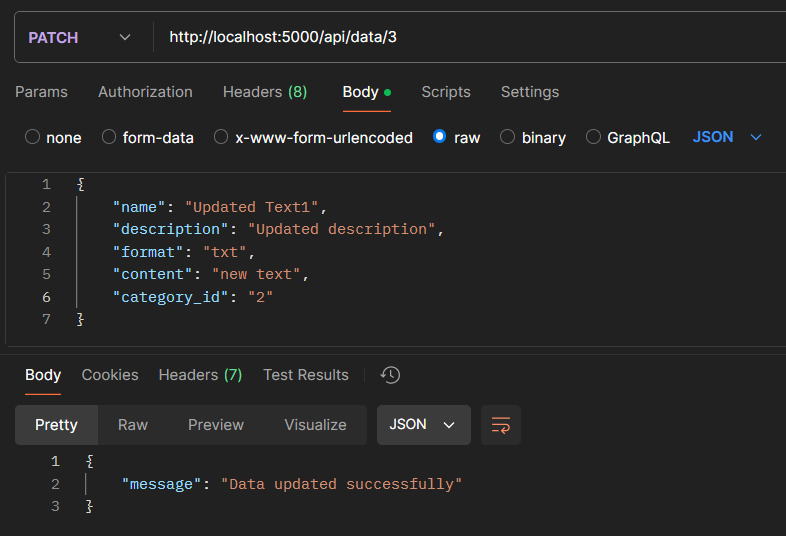
    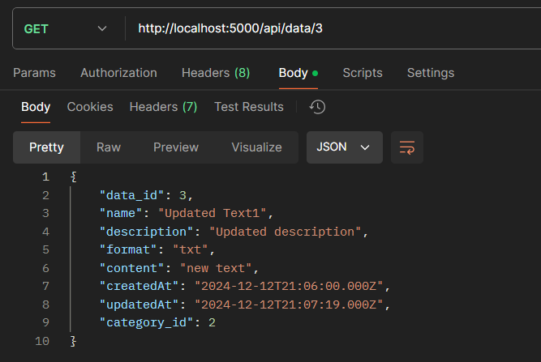

### DELETE /data/:id

    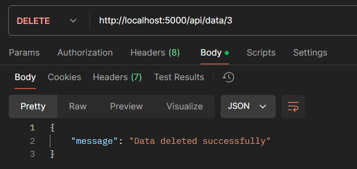
    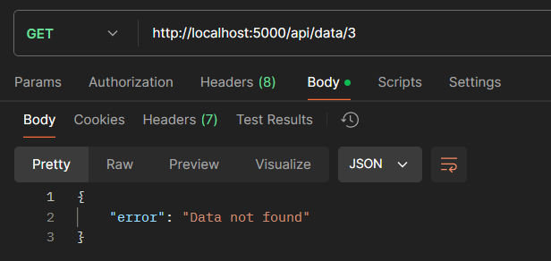

### GET /category/all

    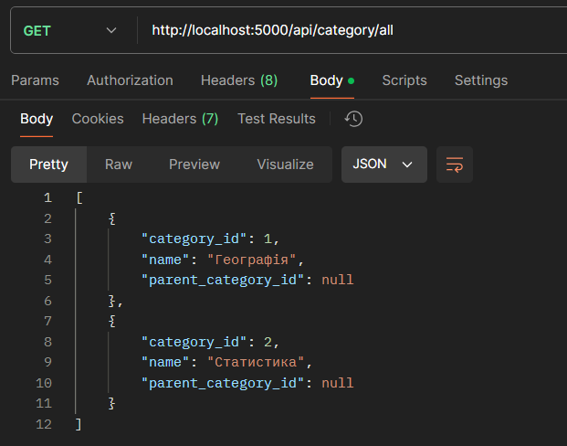

### GET /category/:id

    

### POST /category

    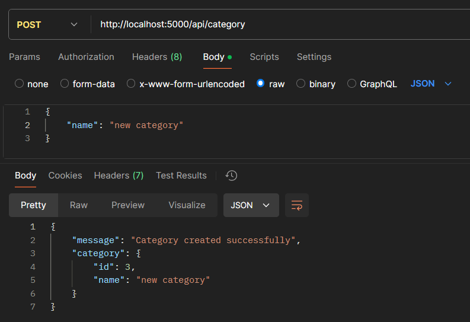

### PATCH /category/:id

    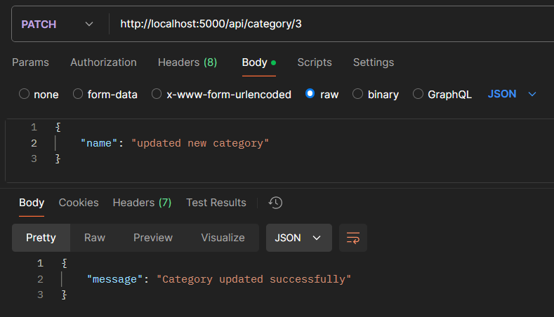
    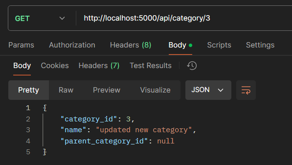

### DELETE /category/:id

    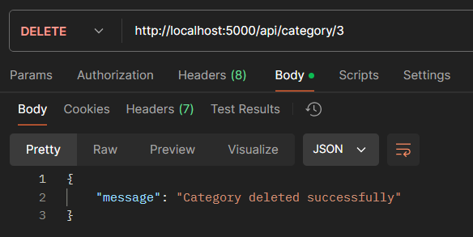
    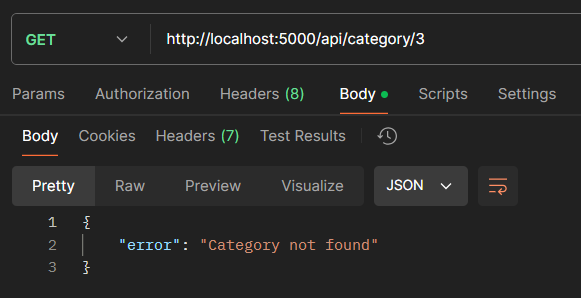

### POST without required fields

    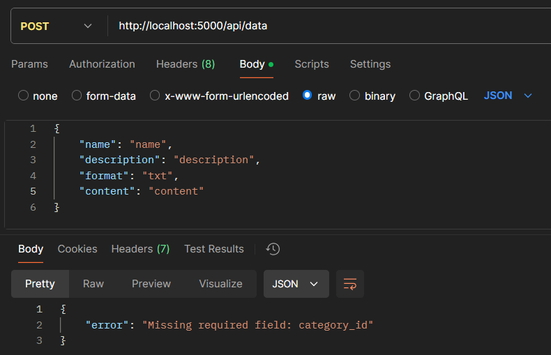

### PATCH with wrong id

    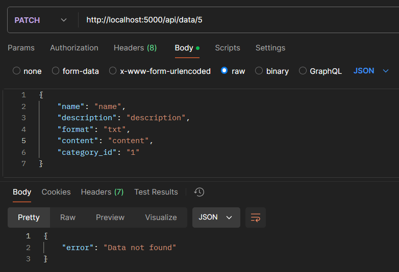
    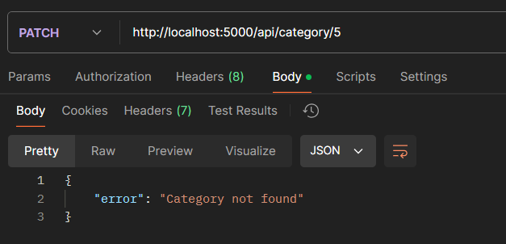

### DELETE with wrong id

    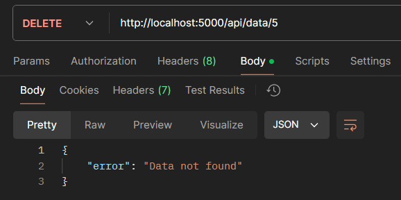
    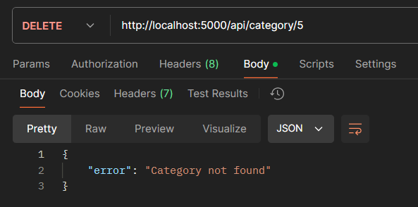

